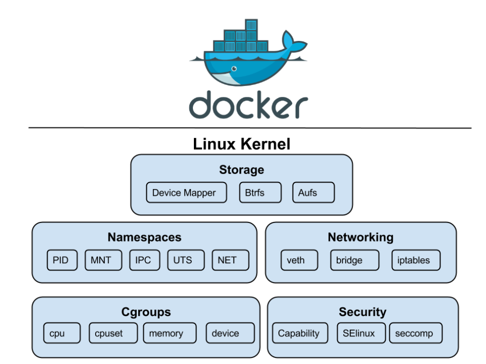
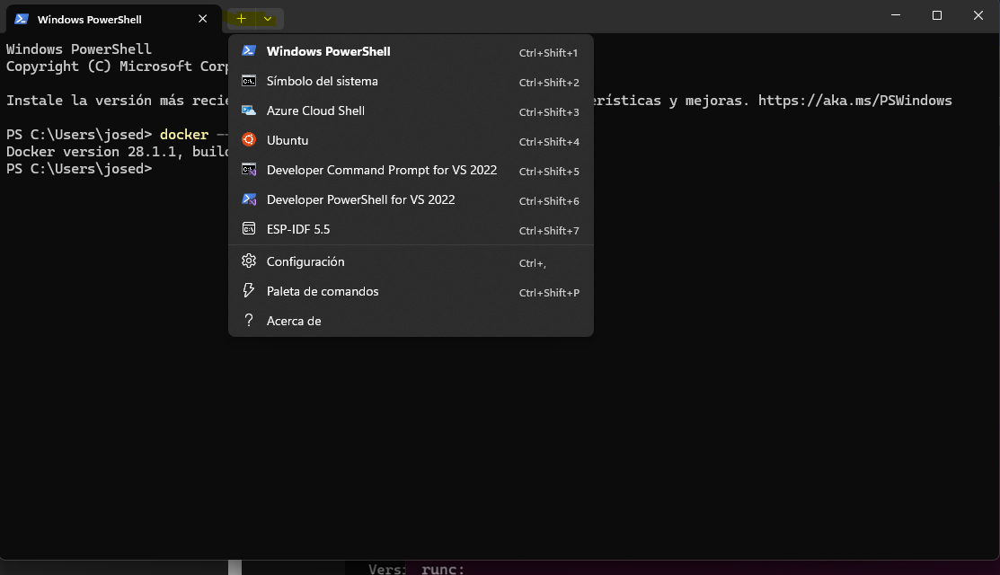
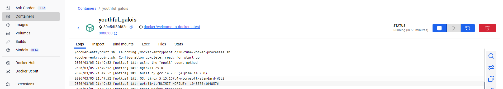
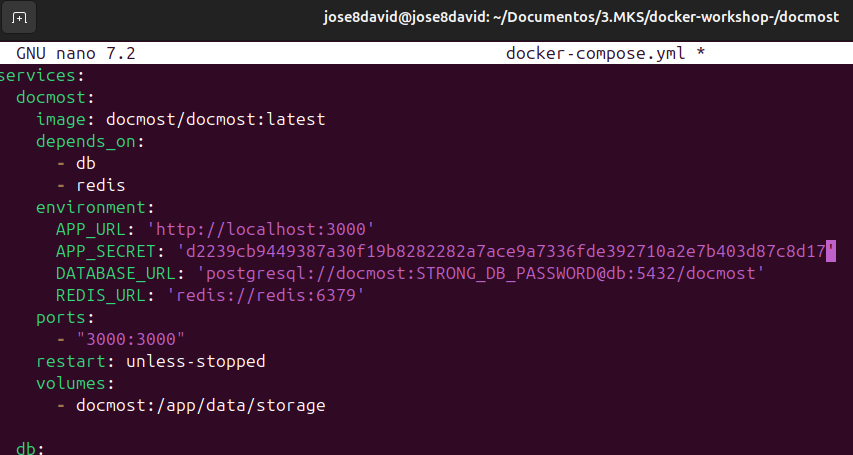
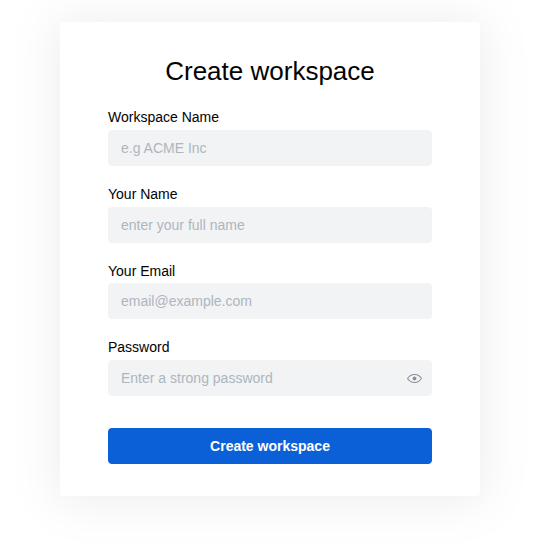
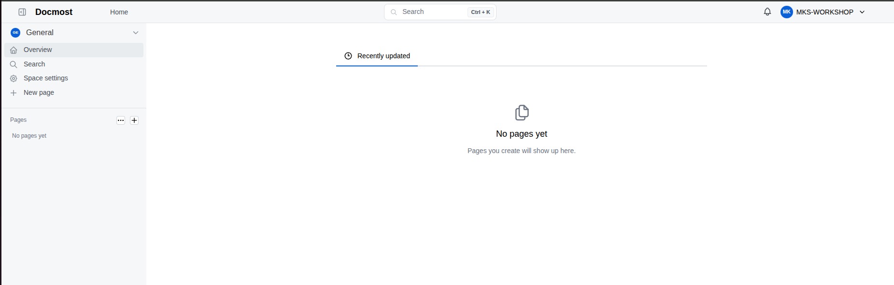

# Docker Workshop

**MakeSpace Association**

https://makespacemadrid.org/

12/03/2026


---
# Why Docker?

Imagine you're developing a killer web app that has three main components: a React frontend, a Python API, and a PostgreSQL database. If you wanted to work on this project, you'd have to install Node, Python, and PostgreSQL.

How do you make sure you have the same versions as your team? Or your CI/CD system? Or what's used in production?

# What is Docker?

Docker is a containerization platform that packages an application and its dependencies into a standardized unit called a container. Containers ensure consistency across different environments by providing an isolated runtime environment.

Unlike virtual machines, containers share the host system's kernel, making them lightweight and efficient.


**Key characteristics:**
- Containers do not require a separate operating system (OS) instance
- They share the underlying OS kernel with the host system
- This eliminates the need for additional OS resources and overhead, making containers lightweight and fast to start

**Docker relies on Linux kernel features:**
- **Namespaces**: Provide isolated environments for processes so that containers do not interfere with each other. Each container has its own network, filesystem, process tree, and other isolated components.
- **cgroups** (control groups): Allow fine-grained control over resource allocation and management, ensuring that each container gets the right amount of CPU, memory, and other resources.


---

# Install Docker Desktop


### Mac
- [Download Docker Desktop for Mac](https://desktop.docker.com/mac/main/arm64/Docker.dmg?utm_source=docker&utm_medium=webreferral&utm_campaign=docs-driven-download-mac-arm64)

### Windows
- [Download Docker Desktop for Windows](https://desktop.docker.com/win/main/amd64/Docker%20Desktop%20Installer.exe?utm_source=docker&utm_medium=webreferral&utm_campaign=docs-driven-download-windows)

**Requirements:**
- Enable **Virtual Machine Platform**
- Enable **Windows Subsystem for Linux (WSL)**
- Open Terminal (PowerShell) and run `docker --version`

**Recommendation:** Install a Linux distribution from the Microsoft Store and integrate it into Docker Desktop




### Linux (Ubuntu 22.04, 24.04 or latest non-LTS)

```bash
# Add Docker's official GPG key:
sudo apt update
sudo apt install ca-certificates curl
sudo install -m 0755 -d /etc/apt/keyrings
sudo curl -fsSL https://download.docker.com/linux/ubuntu/gpg -o /etc/apt/keyrings/docker.asc
sudo chmod a+r /etc/apt/keyrings/docker.asc

# Add the repository to Apt sources:
sudo tee /etc/apt/sources.list.d/docker.sources <<EOF
Types: deb
URIs: https://download.docker.com/linux/ubuntu
Suites: $(. /etc/os-release && echo "${UBUNTU_CODENAME:-$VERSION_CODENAME}")
Components: stable
Signed-By: /etc/apt/keyrings/docker.asc
EOF

# Download and install Docker Desktop
sudo apt update
sudo apt install gnome-terminal
sudo apt-get update
sudo apt install ./docker-desktop-amd64.deb
```

**Recommended VS Code Extension:** Docker (Microsoft)

## Play with Docker

If you want to try Docker without installing it locally:

---

# Containers

**Containers are:**
- **Self-contained**: Each container has everything it needs to function with no reliance on any pre-installed dependencies on the host machine
- **Isolated**: They have minimal influence on the host and other containers, increasing security
- **Independent**: Each container is independently managed. Deleting one container won't affect any others
- **Portable**: Containers can run anywhere - the same container works on your development machine, in a data center, or in the cloud


## Run Your First Container

```bash
docker run -d -p 8080:80 docker/welcome-to-docker
```

Your container is now **accessible** on port 8080. Visit http://localhost:8080


## Basic docker run Command

```bash
docker run -p HostPort:ContainerPort --name container_name image_name
```

- `docker run` creates and starts a container
- `-p HostPort:ContainerPort` creates a port mapping between the host and the container
- `--name container_name` assigns a specific name to the container
- `image_name` specifies the image to be used

**When you run this command:**
1. It searches for the image locally; if not found, it downloads it from Docker Hub
2. It creates and starts the container:
   - Assigns a virtual IP within the Docker network
   - Opens and maps the specified ports

To stop a container running in the foreground, use `Ctrl + C`.

**Run in background:**
```bash
docker run -d -p 8080:80 httpd
```

## Container Management Commands

**List running containers:**
```bash
docker ps
# or
docker container ls
```

**Stop a container:**
```bash
docker stop <id/name>
```
Docker sends a SIGTERM first, and if it doesn't respond, it sends a SIGKILL.

**Start a stopped container:**
```bash
docker start <id>
```

**Delete a container:**
```bash
docker rm <id>
# or force delete
docker rm -f <id>
```

**View container logs:**
```bash
docker logs <id>
```

**Show processes inside container:**
```bash
docker top <id>
```

**Inspect container details:**
```bash
docker inspect <container_id>
```

**View resource usage:**
```bash
docker stats
```

**Show disk space usage:**
```bash
docker system df
```

**Stop all running containers:**
```bash
docker stop $(docker ps -q)
```

**Remove all unused containers:**
```bash
docker prune
```

## Interactive Containers

**Launch a container with interactive shell:**
```bash
docker run -it -p 8080:80 httpd bash
```

Once inside, you can execute commands directly within the container. Verify the environment:
```bash
cat /etc/os-release
```

**Note:** The main process is launched when you execute `docker run`. However, if an additional command is provided (such as `bash`), the container will not exhibit its default behavior.

**Run Ubuntu container:**
```bash
docker run -it ubuntu
```

Inside the container, you can install packages:
```bash
apt-get update
apt-get install wget
apt-get install curl
```

**Tip:** Alpine Linux is a good option for containers because it is very lightweight and secure.

## Manage Containers Using Docker Desktop



Docker Desktop allows you to:
- View container information, including **logs** and **files**
- Access the shell via the **Exec** tab
- Perform actions like **pause, resume, start, or stop**

---

# Docker Images

## What is an Image?

If you're new to container images, think of them as a standardized package that contains everything needed to run an application, including its files, configuration, and dependencies. These packages can be distributed and shared with others.

For a PostgreSQL image, that image will package the database binaries, config files, and other dependencies. For a Python web app, it'll include the Python runtime, your app code, and all of its dependencies.

## Two Important Principles of Images

1. **Images are immutable**: Once an image is created, it can't be modified. You can only make a new image or add changes on top of it.

2. **Images are composed of layers**: Each layer represents a set of file system changes that add, remove, or modify files.

These principles let you extend or add to existing images. For example, if you're building a Python app, you can start from the Python image and add additional layers to install your app's dependencies and add your code.

## Docker Hub

To share your Docker images, you need a place to store them. This is where registries come in.

Docker Hub is the default and go-to registry for images. It provides both a place for you to store your own images and to find images from others to either run or use as the bases for your own images.

## Image Commands

**Download an image from Docker Hub:**
```bash
docker pull <image_name>
```

**List available images:**
```bash
docker image ls
```

**Remove an image:**
```bash
docker image rm <image_name>
```

**Remove all unused images:**
```bash
docker image prune
```

**View image digests:**
```bash
docker images --digests
```

**View image history:**
```bash
docker history <image_name>
```

---

# What is a Dockerfile?

A Dockerfile is a text-based script that provides the instruction set on how to build an image. It contains all the commands needed to create a specific image.

**Example for a simple password generator web app**

Download the password generator web app from GitHub:

https://github.com/makespacemadrid/docker-workshop/tree/main/pass-generator

```bash
docker build -t pwd-gen .
docker run -d -p 8080:80 pwd-gen
```


**The Dockerfile code**

```Dockerfile
FROM nginx:alpine
COPY . /usr/share/nginx/html
EXPOSE 80
CMD ["nginx", "-g", "daemon off;"]
```

---

# Docker Compose

One best practice for containers is that each container should do one thing and do it well.

You can use multiple `docker run` commands to start multiple containers. But you'll need to manage networks, all the flags needed to connect containers to those networks, and more. Cleanup is also more complicated.

With Docker Compose, you can define all of your containers and their configurations in a single YAML file. If you include this file in your code repository, anyone that clones your repository can get up and running with a single command.

It's important to understand that Compose is a declarative tool - you simply define it and go. If you make a change, run `docker compose up` again and Compose will reconcile the changes intelligently.

## Key Commands

```bash
docker compose up -d --build
docker compose down
```

**Note:** By default, volumes aren't automatically removed when you tear down a Compose stack. If you want to remove the volumes, add the `--volumes` flag:
```bash
docker compose down --volumes
```
---

# Networks

- **Network:** A communication path that allows containers to talk to each other or to the outside world.
    
- **Subnet:** A segmented piece of a larger network. In Docker, it defines the range of IP addresses available for containers within that network (e.g., `172.18.0.0/16`).
    
- **Gateway:** The "doorway" or router for a network. It is the IP address that allows traffic to exit the current subnet to reach other networks or the internet.
    

#### 2. Default Networking / Redes por defecto

- **Bridge (Default):** If no network is specified, Docker uses the default bridge. Docker sets up firewall rules (iptables) and NAT (Network Address Translation) to provide internet access via the host.
    
- **Commands:**
    
    - `docker network ls`: List all available networks.
        
    - `docker network inspect <network_name>`: Displays network configuration in JSON format, including IPAM (IP Address Management), subnet, gateway, and connected containers.
        

#### 3. Network Drivers 

- **Bridge:** The standard driver for standalone containers.
    
- **Host:** Removes network isolation between the container and the Docker host. The container uses the host's networking namespace. _Note: Only fully functional on Linux; on macOS/Windows, it shares the IP of the internal VM._
    
- **Null (None):** No network connectivity. Useful for isolated processes.
    

#### 4. Hands-on: Communication 

To test connectivity, install tools inside a container:

Bash

```
apt-get update
apt-get install iproute2 iputils-ping wget -y
ip addr                # Check local IP
ping <other_container_IP>
wget <other_container_IP:PORT>
```

#### 5. Custom Networks & Best Practices

- **Create:** `docker network create <network_name>`
    
- **Manage:**
    
    - `docker run -d --name <name> --network <network_name> <image>`
        
    - `docker network connect <network> <container>`
        
    - `docker network disconnect <network> <container>`
        

#### 6. Service Discovery (DNS) 

- **Key Concept:** When containers share a custom network, they can use their **container names** as hostnames instead of IP addresses. Docker's embedded DNS server handles the resolution.
    
- **Important:** This feature **only works on user-defined networks**. It does not work on the default `bridge` network. Using user-defined networks is a best practice to achieve proper network isolation and easy service discovery.

---
# Volumes

When you delete a container, its internal files are lost. However, there are two main ways to keep your data safe:

1. **Volumes:** Data is stored outside the container's lifecycle. Even if the container is removed, the data persists.
2. **Bind Mounts:** This method links a specific directory on your host machine directly to a directory inside the container.

**Working with Volumes**

In a **Dockerfile**, you can use the `VOLUME` instruction to declare a persistent point. For example, in a MariaDB image:

`VOLUME /var/lib/mysql`

When the container starts, Docker creates a volume and mounts it at `/var/lib/mysql`.

By default, Docker assigns a random, cryptic name to the volume. To make it dentifiable, you should assign a custom name when running the container (e.g., `-v my-db-data:/var/lib/mysql`).

**Useful Commands:**

- `docker volume ls`: Lists all available volumes.
- `docker volume inspect <name>`: Shows detailed information about a specific volume.

**Verifying the Data:**  
If you want to see the files inside, use `docker exec -it <container_id> bash` to enter the container. Once inside, navigate to the directory (`cd /var/lib/mysql`) and run `ls` to list all the persistent files.

**Bind Mounts**

How can I use a host folder with Docker? It's easy. For an Apache container, you must specify the path using the `-v` flag:

`docker run -d -p 80:80 -v C:\hostDir:/usr/local/apache2/htdocs/ httpd`

This command maps your local directory `C:\hostDir` to the container's document root. Any changes you make to the files on your host will immediately reflect inside the container. This is particularly useful for development, as you don't need to rebuild the image to see your code changes.

---

🚀 Challenge: The "Live Code" PHP Server

PHP requires a server-side engine to process the code, whereas HTML is simply rendered by the browser. By using a bind mount, we can edit our code on the host machine and see the results instantly inside the container.

You will use Docker to spin up a professional web server in seconds and link your local folder to it using a **Bind Mount**

```php
<?php
	echo "<h1>Hi! You are in MakeSpace :) </h1>";
	echo "<p>Current server time" . date('H:i:s') ."</p>";
	echo "<p>Try changing this text in your editor and refreshing the page.</p>";
?>
```

`docker run -d -p 8080:80 --name php-server -v C:\host dir:/var/www/html php:apache`

---

# Docmost: Open-Source Collaborative Wiki

[Docmost](https://docmost.com/) is an **enterprise-ready**, open-source collaborative wiki and documentation platform. It is designed for seamless **real-time collaboration**, allowing multiple users to edit the same page simultaneously without conflicts or data loss.

## Installation Steps

## 1. Setup the Docker Compose File

First, create a dedicated directory for your Docmost installation and download the official configuration file.

```bash
mkdir docmost
cd docmost
# Download the official docker-compose file
curl -O https://raw.githubusercontent.com/docmost/docmost/main/docker-compose.yml
```

Open the file with your preferred text editor (e.g., Nano or Vi):

```bash
nano docker-compose.yml
# OR
vi docker-compose.yml
```

## 2. Configure Environment Variables

You **must** replace the default environment variables to ensure the application starts correctly and securely.

- **`APP_URL`**: Replace this with your domain or IP (e.g., `http://localhost:3000` for local testing or `https://wiki.example.com` for production).
    
- **`APP_SECRET`**: This must be a long, random string (minimum 32 characters).
    
- **Database Credentials**: Replace `STRONG_DB_PASSWORD` in both `POSTGRES_PASSWORD` and the `DATABASE_URL` string with a secure password of your choice.
    

> [!CAUTION] 
> If you keep the default values, the application will fail to start for security reasons.



> [!TIP] You can quickly generate a secure 32-character secret using OpenSSL:
> 
> 
> 
> ```bash
> openssl rand -hex 32
> ```

## 3. Start the Services

Run the following command in the directory containing your `docker-compose.yml` file:


```bash
docker compose up -d
```

_The `-d` flag runs the containers in **detached mode**, meaning they will keep running in the background._

> [!IMPORTANT] **Troubleshooting:** If you see the error `Cannot connect to the Docker daemon`, ensure that the Docker service is running on your machine:
> 
> - **Linux:** `sudo systemctl start docker`
>     
> - **Desktop:** Open the Docker Desktop application.
>     

## 4. Verification and Access

Docker will pull the necessary images, create a default network (`docmost_default`), and set up the persistent volumes. To check the status of your containers, run:


```bash
docker compose ps
```

Once all containers show as `running` or `healthy`, you can access Docmost through your browser at: **`http://localhost:3000`**



