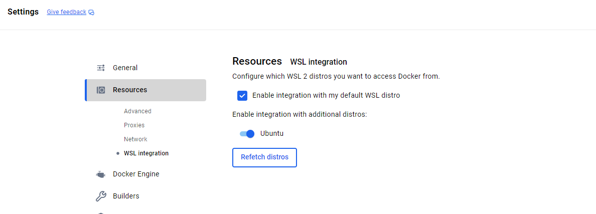

# 2. Installation

## Install Docker Desktop

### Mac
- [Download Docker Desktop for Mac](https://desktop.docker.com/mac/main/arm64/Docker.dmg?utm_source=docker&utm_medium=webreferral&utm_campaign=docs-driven-download-mac-arm64)

### Windows
- [Download Docker Desktop for Windows](https://desktop.docker.com/win/main/amd64/Docker%20Desktop%20Installer.exe?utm_source=docker&utm_medium=webreferral&utm_campaign=docs-driven-download-windows)

**Requirements:**
- Enable **Virtual Machine Platform**
- Enable **Windows Subsystem for Linux (WSL)**
- Open Terminal (PowerShell) and run `docker --version`

**Recommendation:** Install a Linux distribution from the Microsoft Store and integrate it into Docker Desktop




### Linux (Ubuntu 22.04, 24.04 or latest non-LTS)

```bash
# Add Docker's official GPG key:
sudo apt update
sudo apt install ca-certificates curl
sudo install -m 0755 -d /etc/apt/keyrings
sudo curl -fsSL https://download.docker.com/linux/ubuntu/gpg -o /etc/apt/keyrings/docker.asc
sudo chmod a+r /etc/apt/keyrings/docker.asc

# Add the repository to Apt sources:
sudo tee /etc/apt/sources.list.d/docker.sources <<EOF
Types: deb
URIs: https://download.docker.com/linux/ubuntu
Suites: $(. /etc/os-release && echo "${UBUNTU_CODENAME:-$VERSION_CODENAME}")
Components: stable
Signed-By: /etc/apt/keyrings/docker.asc
EOF

# Download and install Docker Desktop
sudo apt update
sudo apt install gnome-terminal
sudo apt-get update
sudo apt install ./docker-desktop-amd64.deb
```

**Recommended VS Code Extension:** Docker (Microsoft)

## Play with Docker

If you want to try Docker without installing it locally:

```bash
docker run -p 8080:80 httpd
```

```bash
mkdir project
cd project
mkdir 1_project
# Now you can drag and drop files into the terminal
unzip your_file_name.zip
```
