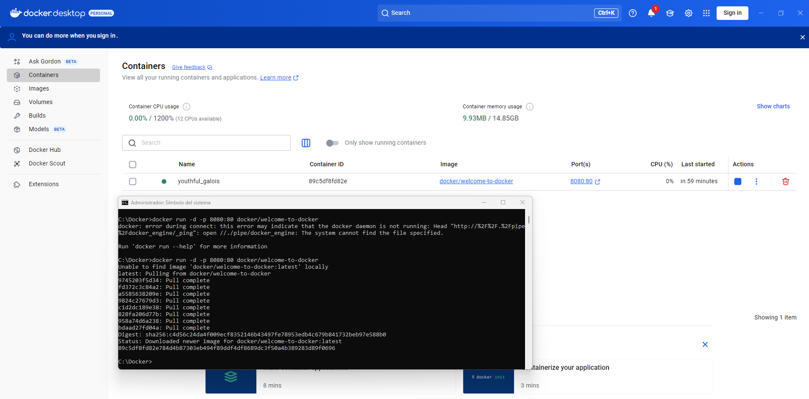
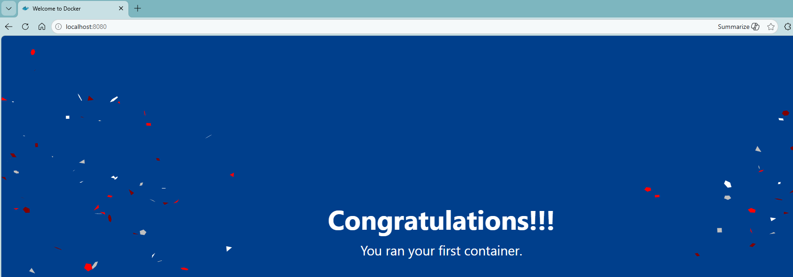
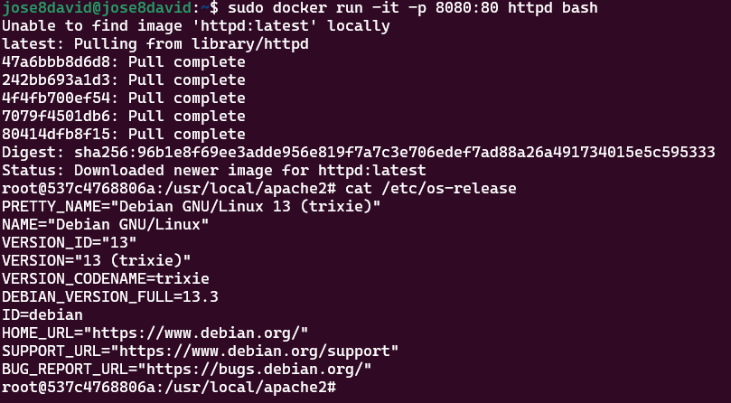

# 4. Working with Containers

## Run Your First Container

```bash
docker run -d -p 8080:80 docker/welcome-to-docker
```

Your container is now **accessible** on port 8080. Visit http://localhost:8080





## Basic docker run Command

```bash
docker run -p HostPort:ContainerPort --name container_name image_name
```

- `docker run` creates and starts a container
- `-p HostPort:ContainerPort` creates a port mapping between the host and the container
- `--name container_name` assigns a specific name to the container
- `image_name` specifies the image to be used

**When you run this command:**
1. It searches for the image locally; if not found, it downloads it from Docker Hub
2. It creates and starts the container:
   - Assigns a virtual IP within the Docker network
   - Opens and maps the specified ports

To stop a container running in the foreground, use `Ctrl + C`.

**Run in background:**
```bash
docker run -d -p 8080:80 httpd
```

## Container Management Commands

**List running containers:**
```bash
docker ps
# or
docker container ls
```

**Stop a container:**
```bash
docker stop <id/name>
```
Docker sends a SIGTERM first, and if it doesn't respond, it sends a SIGKILL.

**Start a stopped container:**
```bash
docker start <id>
```

**Delete a container:**
```bash
docker rm <id>
# or force delete
docker rm -f <id>
```

**View container logs:**
```bash
docker logs <id>
```

**Show processes inside container:**
```bash
docker top <id>
```

**Inspect container details:**
```bash
docker inspect <container_id>
```

**View resource usage:**
```bash
docker stats
```

**Show disk space usage:**
```bash
docker system df
```

**Stop all running containers:**
```bash
docker stop $(docker ps -q)
```

**Remove all unused containers:**
```bash
docker prune
```

## Interactive Containers

**Launch a container with interactive shell:**
```bash
docker run -it -p 8080:80 httpd bash
```

Once inside, you can execute commands directly within the container. Verify the environment:
```bash
cat /etc/os-release
```

**Note:** The main process is launched when you execute `docker run`. However, if an additional command is provided (such as `bash`), the container will not exhibit its default behavior.

**Run Ubuntu container:**
```bash
docker run -it ubuntu
```

Inside the container, you can install packages:
```bash
apt-get update
apt-get install wget
apt-get install curl
```

**Tip:** Alpine Linux is a good option for containers because it is very lightweight and secure.

## Manage Containers Using Docker Desktop


Docker Desktop allows you to:
- View container information, including **logs** and **files**
- Access the shell via the **Exec** tab
- Perform actions like **pause, resume, start, or stop**

**Traefik Proxy:** Traefik is an application proxy that routes requests to the right service. It sends all requests for `localhost/api/*` to the backend, requests for `localhost/*` to the frontend, and requests for `db.localhost` to phpMyAdmin. This provides access to all applications using port 80.


