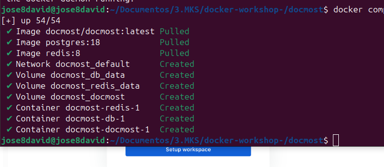

# Docmost: Open-Source Collaborative Wiki

[Docmost](https://docmost.com/) is an **enterprise-ready**, open-source collaborative wiki and documentation platform. It is designed for seamless **real-time collaboration**, allowing multiple users to edit the same page simultaneously without conflicts or data loss.

## Installation Steps

## 1. Setup the Docker Compose File

First, create a dedicated directory for your Docmost installation and download the official configuration file.

```bash
mkdir docmost
cd docmost
# Download the official docker-compose file
curl -O https://raw.githubusercontent.com/docmost/docmost/main/docker-compose.yml
```

Open the file with your preferred text editor (e.g., Nano or Vi):

```bash
nano docker-compose.yml
# OR
vi docker-compose.yml
```

## 2. Configure Environment Variables

You **must** replace the default environment variables to ensure the application starts correctly and securely.

- **`APP_URL`**: Replace this with your domain or IP (e.g., `http://localhost:3000` for local testing or `https://wiki.example.com` for production).
    
- **`APP_SECRET`**: This must be a long, random string (minimum 32 characters).
    
- **Database Credentials**: Replace `STRONG_DB_PASSWORD` in both `POSTGRES_PASSWORD` and the `DATABASE_URL` string with a secure password of your choice.
    

> [!CAUTION] 
> If you keep the default values, the application will fail to start for security reasons.


> [!TIP] You can quickly generate a secure 32-character secret using OpenSSL:
> 
> 
> 
> ```bash
> openssl rand -hex 32
> ```

## 3. Start the Services

Run the following command in the directory containing your `docker-compose.yml` file:


```bash
docker compose up -d
```

_The `-d` flag runs the containers in **detached mode**, meaning they will keep running in the background._

> [!IMPORTANT] **Troubleshooting:** If you see the error `Cannot connect to the Docker daemon`, ensure that the Docker service is running on your machine:
> 
> - **Linux:** `sudo systemctl start docker`
>     
> - **Desktop:** Open the Docker Desktop application.
>     

## 4. Verification and Access

Docker will pull the necessary images, create a default network (`docmost_default`), and set up the persistent volumes. To check the status of your containers, run:




```bash
docker compose ps
```

Once all containers show as `running` or `healthy`, you can access Docmost through your browser at: **`http://localhost:3000`**


