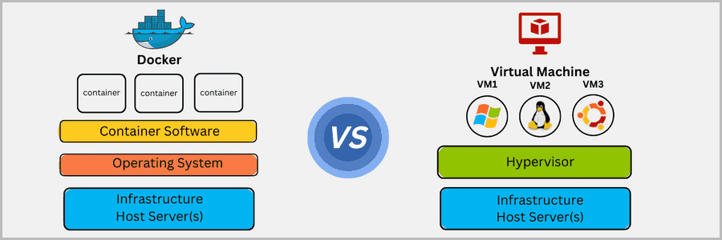

# Docker Workshop

MkS Association

---

# What is Docker?

Docker is a containerization platform that packages an application and its dependencies into a standardized unit called a container. Containers ensure consistency across different environments by providing an isolated runtime environment.

Unlike virtual machines, containers share the host system's kernel, making them lightweight and efficient.

**Key characteristics:**
- Containers do not require a separate operating system (OS) instance
- They share the underlying OS kernel with the host system
- This eliminates the need for additional OS resources and overhead, making containers lightweight and fast to start

**Docker relies on Linux kernel features:**
- **Namespaces**: Provide isolated environments for processes so that containers do not interfere with each other. Each container has its own network, filesystem, process tree, and other isolated components.
- **cgroups** (control groups): Allow fine-grained control over resource allocation and management, ensuring that each container gets the right amount of CPU, memory, and other resources.

---

# Why Docker?

Imagine you're developing a killer web app that has three main components: a React frontend, a Python API, and a PostgreSQL database. If you wanted to work on this project, you'd have to install Node, Python, and PostgreSQL.

How do you make sure you have the same versions as your team? Or your CI/CD system? Or what's used in production?

**Containers are:**
- **Self-contained**: Each container has everything it needs to function with no reliance on any pre-installed dependencies on the host machine
- **Isolated**: They have minimal influence on the host and other containers, increasing security
- **Independent**: Each container is independently managed. Deleting one container won't affect any others
- **Portable**: Containers can run anywhere - the same container works on your development machine, in a data center, or in the cloud

---

# Install Docker Desktop

## Mac
- [Download Docker Desktop for Mac](https://desktop.docker.com/mac/main/arm64/Docker.dmg?utm_source=docker&utm_medium=webreferral&utm_campaign=docs-driven-download-mac-arm64)

## Windows
- [Download Docker Desktop for Windows](https://desktop.docker.com/win/main/amd64/Docker%20Desktop%20Installer.exe?utm_source=docker&utm_medium=webreferral&utm_campaign=docs-driven-download-windows)

**Requirements:**
- Enable **Virtual Machine Platform**
- Enable **Windows Subsystem for Linux (WSL)**
- Open Terminal (PowerShell) and run `docker --version`

**Recommendation:** Install a Linux distribution from the Microsoft Store and integrate it into Docker Desktop

## Linux (Ubuntu 22.04, 24.04 or latest non-LTS)

```bash
# Add Docker's official GPG key:
sudo apt update
sudo apt install ca-certificates curl
sudo install -m 0755 -d /etc/apt/keyrings
sudo curl -fsSL https://download.docker.com/linux/ubuntu/gpg -o /etc/apt/keyrings/docker.asc
sudo chmod a+r /etc/apt/keyrings/docker.asc

# Add the repository to Apt sources:
sudo tee /etc/apt/sources.list.d/docker.sources <<EOF
Types: deb
URIs: https://download.docker.com/linux/ubuntu
Suites: $(. /etc/os-release && echo "${UBUNTU_CODENAME:-$VERSION_CODENAME}")
Components: stable
Signed-By: /etc/apt/keyrings/docker.asc
EOF

# Download and install Docker Desktop
sudo apt update
sudo apt install gnome-terminal
sudo apt-get update
sudo apt install ./docker-desktop-amd64.deb
```

**Recommended VS Code Extension:** Docker (Microsoft)

---

# Run Your First Container

```bash
docker run -d -p 8080:80 docker/welcome-to-docker
```

Your container is now **accessible** on port 8080. Visit http://localhost:8080


---

# Manage Containers Using Docker Desktop


Docker Desktop allows you to:
- View container information, including **logs** and **files**
- Access the shell via the **Exec** tab
- Perform actions like **pause, resume, start, or stop**

**Traefik Proxy:** Traefik is an application proxy that routes requests to the right service. It sends all requests for `localhost/api/*` to the backend, requests for `localhost/*` to the frontend, and requests for `db.localhost` to phpMyAdmin. This provides access to all applications using port 80.

---

# The Containerized Environment

The containerized environment provides everything you need for development. You don't have to install Node, MySQL, or any other dependencies directly on your machine. All you need is Docker Desktop and a code editor.

Make changes and see them immediately. This is possible because:
1. The processes running in each container are watching and responding to file changes
2. The files are shared with the containerized environment

---

# Docker Images

If you're new to container images, think of them as a standardized package that contains everything needed to run an application, including its files, configuration, and dependencies. These packages can be distributed and shared with others.

**Two important principles of images:**

1. **Images are immutable**: Once an image is created, it can't be modified. You can only make a new image or add changes on top of it.

2. **Images are composed of layers**: Each layer represents a set of file system changes that add, remove, or modify files.

These principles let you extend or add to existing images. For example, if you're building a Python app, you can start from the Python image and add additional layers to install your app's dependencies and add your code.

---

# Docker Hub

To share your Docker images, you need a place to store them. This is where registries come in.

Docker Hub is the default and go-to registry for images. It provides both a place for you to store your own images and to find images from others to either run or use as the bases for your own images.

---

# Docker Images Commands

**Download an image from Docker Hub:**
```bash
docker pull <image_name>
```

**List available images:**
```bash
docker image ls
```

**Remove an image:**
```bash
docker image rm <image_name>
```

**Remove all unused images:**
```bash
docker image prune
```

**View image digests:**
```bash
docker images --digests
```

**View image history:**
```bash
docker history <image_name>
```

**View container changes:**
```bash
docker diff <container_id>
```
- C = changes
- A = additions
- D = deletions

---

# What is a Dockerfile?

A Dockerfile is a text-based script that provides the instruction set on how to build an image. It contains all the commands needed to create a specific image.

**Key instruction: FROM**

The `FROM` keyword indicates the base image. It could be `scratch`, meaning that the image will be empty.

Any machine that runs a container using the image will be able to run the application as it was built without needing anything else pre-installed on the machine.

---

# Working with Containers

**Basic docker run command:**
```bash
docker run -p HostPort:ContainerPort --name container_name image_name
```

- `docker run` creates and starts a container
- `-p HostPort:ContainerPort` creates a port mapping between the host and the container
- `--name container_name` assigns a specific name to the container
- `image_name` specifies the image to be used

**When you run this command:**
1. It searches for the image locally; if not found, it downloads it from Docker Hub
2. It creates and starts the container:
   - Assigns a virtual IP within the Docker network
   - Opens and maps the specified ports

To stop a container running in the foreground, use `Ctrl + C`.

**Run in background:**
```bash
docker run -d -p 8080:80 httpd
```

---

# Container Management Commands

**List running containers:**
```bash
docker ps
# or
docker container ls
```

**Stop a container:**
```bash
docker stop <id/name>
```
Docker sends a SIGTERM first, and if it doesn't respond, it sends a SIGKILL.

**Start a stopped container:**
```bash
docker start <id>
```

**Delete a container:**
```bash
docker rm <id>
# or force delete
docker rm -f <id>
```

**View container logs:**
```bash
docker logs <id>
```

**Show processes inside container:**
```bash
docker top <id>
```

**Inspect container details:**
```bash
docker inspect <container_id>
```

**View resource usage:**
```bash
docker stats
```

**Show disk space usage:**
```bash
docker system df
```

---

# Container Management (Continued)

**Stop all running containers:**
```bash
docker stop $(docker ps -q)
```

**Remove all unused containers:**
```bash
docker prune
```

---

# Interactive Containers

**Launch a container with interactive shell:**
```bash
docker run -it -p 8080:80 httpd bash
```

Once inside, you can execute commands directly within the container. Verify the environment:
```bash
cat /etc/os-release
```

**Note:** The main process is launched when you execute `docker run`. However, if an additional command is provided (such as `bash`), the container will not exhibit its default behavior.

**Run Ubuntu container:**
```bash
docker run -it ubuntu
```

Inside the container, you can install packages:
```bash
apt-get update
apt-get install wget
apt-get install curl
```

**Tip:** Alpine Linux is a good option for containers because it is very lightweight and secure.

---

# Docker Compose

One best practice for containers is that each container should do one thing and do it well.

You can use multiple `docker run` commands to start multiple containers. But you'll need to manage networks, all the flags needed to connect containers to those networks, and more. Cleanup is also more complicated.

With Docker Compose, you can define all of your containers and their configurations in a single YAML file. If you include this file in your code repository, anyone that clones your repository can get up and running with a single command.

**Key commands:**
```bash
docker compose up -d --build
docker compose down
```

It's important to understand that Compose is a declarative tool - you simply define it and go. If you make a change, run `docker compose up` again and Compose will reconcile the changes intelligently.

**Note:** By default, volumes aren't automatically removed when you tear down a Compose stack. If you want to remove the volumes, add the `--volumes` flag:
```bash
docker compose down --volumes
```

---

# Play with Docker

If you want to try Docker without installing it locally:

```bash
docker run -p 8080:80 httpd
```

```bash
mkdir project
cd project
mkdir 1_project
# Now you can drag and drop files into the terminal
unzip your_file_name.zip
```

---

# Summary

- **Docker** packages applications and their dependencies into containers
- **Images** are immutable templates used to create containers
- **Dockerfile** defines how to build an image
- **Docker Hub** is the default registry for sharing images
- **Containers** are isolated, portable, and self-contained
- **Docker Compose** manages multi-container applications




